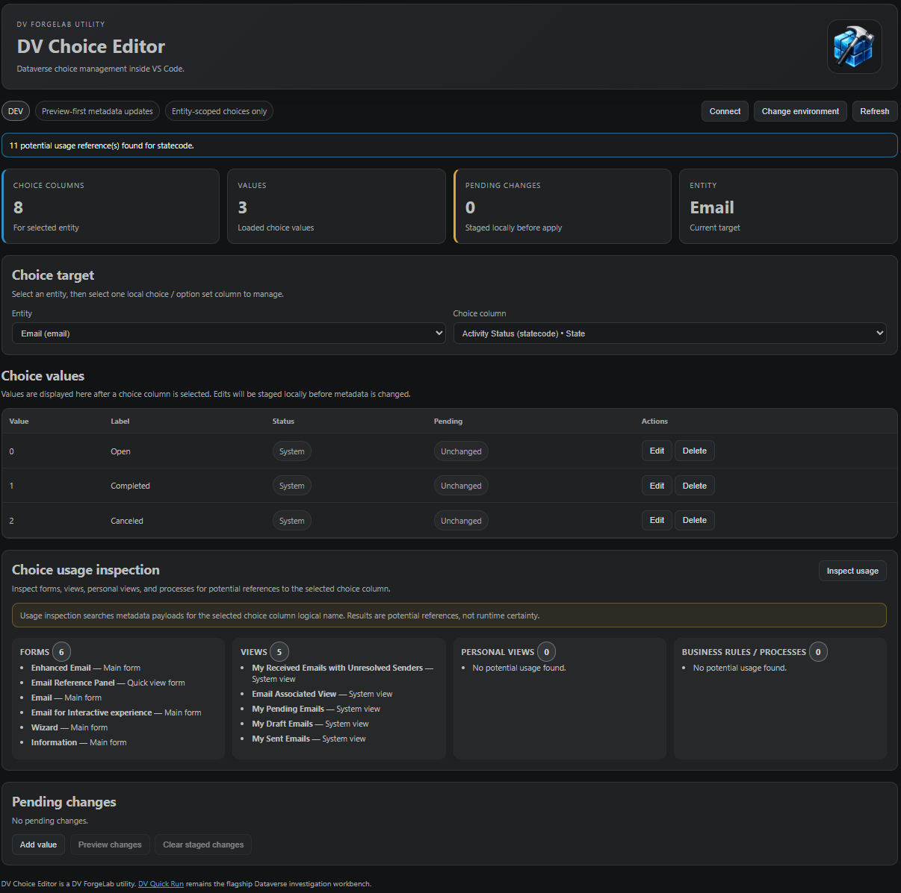

# DV Choice Editor

Dataverse choice management inside VS Code.

**DV Choice Editor** is a focused utility from **DV ForgeLab** for managing Dataverse local choice (option set) values directly from VS Code.

The extension provides a lightweight, preview-first workflow for creating, updating, deleting, reviewing, and publishing Dataverse choice values without leaving the development workspace.

## Screenshot



### Highlights

- Preview-first metadata updates
- Environment-aware publishing (DEV / TEST / PROD)
- Staged changes before publish
- Add, update, and delete choice values
- Safety guardrails for production environments
- Built for Dataverse developers working inside VS Code

---

## Features

### Manage Dataverse Choice Values

- Browse entity-scoped choice columns
- View existing choice values
- Create new choice values
- Update choice labels
- Delete choice values
- Preview metadata changes before publishing

### Preview-First Workflow

All metadata changes are staged locally before being applied.

```text
Select entity
↓
Select choice column
↓
Stage changes
↓
Review preview
↓
Apply and publish
```

### Environment Awareness

DV Choice Editor detects the connected environment and provides visual indicators:

* DEV
* TEST
* PROD

Production-class environments display elevated publish warnings before metadata changes are applied.

### Safety Features

* Preview-first mutation workflow
* Local staging before publish
* Remove individual staged changes
* Clear all staged changes
* Prevent deletion of the final remaining choice value
* Boolean columns automatically excluded
* Choice values treated as immutable identities after creation
* Inspect potential usage across forms, views, personal views, and processes

## Shared DV ForgeLab Environment Settings

DV Choice Editor supports the shared DV ForgeLab environment setting:

```json
"dvForgeLab.environments": [
  {
    "name": "DEV",
    "url": "https://org.crm6.dynamics.com",
    "tenantId": "optional-tenant-id"
  }
]
```

This setting can be reused by DV ForgeLab utilities. The legacy `dvChoiceEditor.environments` setting remains supported as a fallback.

---

## Commands

### Open Choice Editor

```text
DV Choice Editor: Open Choice Editor
```

---

## Scope

DV Choice Editor intentionally focuses on a single operational task:

**Managing Dataverse local choice values.**

The extension does not currently provide:

* Global choice management
* CSV import/export
* Solution management
* Metadata administration beyond choice values
* Bulk editing workflows

---

## Why DV Choice Editor?

Many Dataverse customization tasks still require switching between browser-based administration experiences and development tooling.

DV Choice Editor brings a focused choice management workflow directly into VS Code while preserving explicit review and publish steps.

---

## Part of the DV ForgeLab Family

DV Choice Editor is a focused Dataverse utility from DV ForgeLab.

For operational investigation, execution, runtime analysis, and cross-environment comparison, see [DV Quick Run](https://marketplace.visualstudio.com/items?itemName=dv-forgelab.dv-quick-run).

DV Choice Editor follows the same principles:

* Preview-first
* Environment-aware
* Metadata-backed
* Explicit execution
* Calm operational UX

---

## Version

### v1.0.0

Initial public release.

Features included:

* Entity-scoped choice discovery
* Choice value browsing
* Add value workflow
* Edit label workflow
* Delete value workflow
* Preview changes
* Environment-aware publishing
* Staged change management
* Production safety indicators

---

Built by **DV ForgeLab**.
